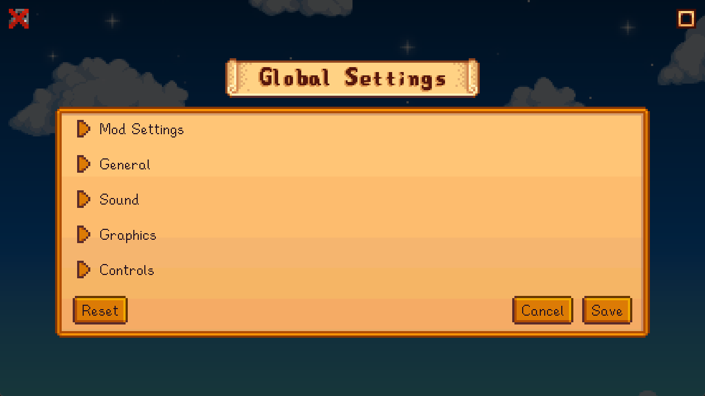
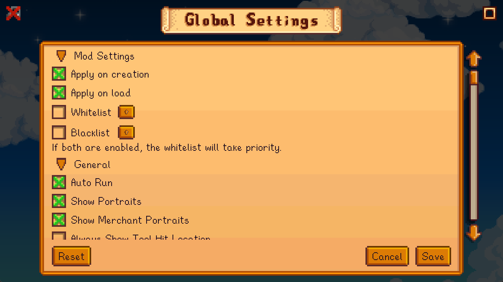
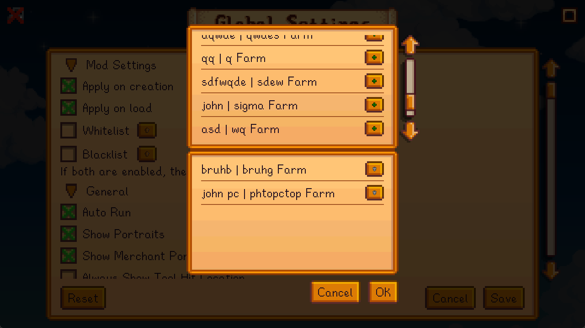

# Global Config Settings Rewrite
GCSR is a Stardew Valley mod that allows you to change the game settings for all saves, it is a rewrite of [Global Config Settings](https://github.com/Gaphodil/GlobalConfigSettings).

[Nexus Page](https://www.nexusmods.com/stardewvalley/mods/33653)

## Installation
1. Install [SMAPI](https://smapi.io)
2. Download focustense's [StardewUI](https://github.com/focustense/StardewUI) mod
3. Download the mod from [Releases](https://github.com/FawazTakahji/GlobalConfigSettingsRewrite/releases)

## Features
- Apply settings to all saves
- Whitelist and blacklist saves

## Configuring Settings
### GMCM
If you have GMCM installed, you can open the GMCM menu and open the menu from there.

### Iconic Framework
If you have Iconic Framework installed, you can open the menu from the button located next to the toolbar.

### Star Control
If you have Star Control installed, you can open the menu using the shortcut.

### Console
You can use the command `gcsr_open` to open the menu.

### config.json
You can edit the config.json file to change the settings.

#### Values
| Setting | Values | In-Game Value |
| --- | --- | --- |
| Whitelist | An array of save folder names to whitelist, ex: `["save1_405438854", "save2_404844190"]` | |
| Blacklist | An array of save folder names to blacklist, ex: `["save1_405438854", "save2_404844190"]` | |
| GamepadMode | `Auto`, `ForceOn`, `ForceOff` | `Auto-detect`, `Force On`, `Force Off` |
| StowingMode | `Off`, `GamepadOnly`, `Both` | `Off`, `Gamepad Only`, `On` |
| UseLegacySlingshotFiring | `false`, `true` | `Hold and release`, `Pull in opposite direction` |
| MusicVolume | `0` to `100` | |
| SoundVolume | `0` to `100` | |
| AmbientVolume | `0` to `100` | |
| FootstepVolume | `0` to `100` | |
| FishingBiteSound | `-1`, `0`, `1`, `2`, `3` | `Default`, `1`, `2`, `3`, `4` |
| MenuBackgrounds | `Standard`, `Graphical`, `None` | |
| UiScale | `75` to `150`, in increments of `5` | |
| ZoomLevel | `75` to `200`, in increments of `5` | |
| SnowTransparency | `0` to `100` | |
| Key Bind | [Check this page](https://stardewvalleywiki.com/Modding:Player_Guide/Key_Bindings#Button_codes) | |

## Screenshots
<details>
  <summary>Menu</summary>

  
</details>
<details>
  <summary>Menu Expanded</summary>

  
</details>
<details>
  <summary>Filter</summary>

  
</details>

## Building
The mod build package should be able to locate your game folder automatically, if it cant find it or if you want to specify it manually, edit the csproj file like so:
```xml
<PropertyGroup>
    ...
    <GamePath>Your Game Path</GamePath>
    ...
</PropertyGroup>
```
If you want to set this path for all projects, create a file called `stardewvalley.targets` in your home folder (`%userprofile%` | `~`) and add the following:
```xml
<Project>
   <PropertyGroup>
      <GamePath>Your Game Path</GamePath>
   </PropertyGroup>
</Project>
```

You should now be able to build and debug the mod using your IDE